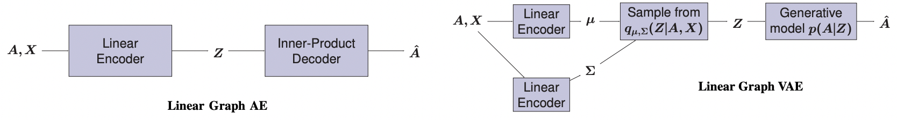
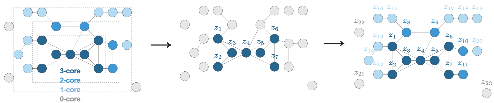

# Linear Graph Autoencoders

This repository provides Python code to reproduce experiments from the article [Keep It Simple: Graph Autoencoders Without Graph Convolutional Networks](https://arxiv.org/pdf/1910.00942.pdf) presented at the NeurIPS 2019 Workshop on Graph Representation Learning. 

***Update**: an extended conference version of this article is now available here: [Simple and Effective Graph Autoencoders with One-Hop Linear Models](https://arxiv.org/pdf/2001.07614.pdf) (accepted at ECML-PKDD 2020).*

We release Tensorflow implementations of the following **two graph embedding models** from the paper:
 - Linear Graph Autoencoders
 - Linear Graph Variational Autoencoders

together with standard Graph Autoencoders (AE) and Graph Variational Autoencoders (VAE) models (with 2-layer or 3-layer Graph Convolutional Networks encoders) from [Kipf and Welling (2016)](https://arxiv.org/pdf/1611.07308.pdf). 

We evaluate all models on the **link prediction** and **node clustering** tasks introduced in the paper. We provide the **Cora**, **Citeseer** and **Pubmed** datasets in the `data` folder, and refer to section 4 of the paper for direct link to the additional datasets used in our experiments.

Our code builds upon Thomas Kipf's [original Tensorflow implementation](https://github.com/tkipf/gae) of standard Graph AE/VAE.



#### Scaling-Up Graph AE and VAE

Standard Graph AE and VAE models suffer from scalability issues. In order to scale them to **large graphs** with millions of nodes and egdes, we also provide an implementation of our framework from the article [A Degeneracy Framework for Scalable Graph Autoencoders](https://arxiv.org/pdf/1902.08813.pdf) (IJCAI 2019). In this paper, we propose to train the graph AE/VAE only from a dense subset of nodes, namely the [k-core or k-degenerate](https://networkx.github.io/documentation/stable/reference/algorithms/core.html) subgraph. Then, we propagate embedding representations to the remaining nodes using faster heuristics.

***Update**: in [this other repository](https://github.com/deezer/fastgae), we provide an implementation of **FastGAE**, a new (and more effective) method from our group to scale Graph AE and VAE.*




## Installation

```bash
python setup.py install
```

Requirements: tensorflow (1.X), networkx, numpy, scikit-learn, scipy


## Run Experiments

```bash
cd linear_gae
python train.py --model=gcn_vae --dataset=cora --task=link_prediction
python train.py --model=linear_vae --dataset=cora --task=link_prediction
```

The above commands will train a *standard Graph VAE with 2-layer GCN encoders (line 2)* and a *Linear Graph VAE (line 3)* on *Cora dataset* and will evaluate embeddings on the *Link Prediction* task, with all parameters set to default values.

```bash
python train.py --model=gcn_vae --dataset=cora --task=link_prediction --kcore=True --k=2
python train.py --model=gcn_vae --dataset=cora --task=link_prediction --kcore=True --k=3
python train.py --model=gcn_vae --dataset=cora --task=link_prediction --kcore=True --k=4
```

By adding `--kcore=True`, the model will only be trained on the k-core subgraph instead of using the entire graph. Here, k is a parameter (from 0 to the maximal core number of the graph) to specify using the `--k` flag.

#### Complete list of parameters


| Parameter        | Type           | Description  | Default Value |
| :-------------: |:-------------:| :-------------------------------|:-------------: |
| `model`     | string | Name of the model, among:<br> - `gcn_ae`: Graph AE from Kipf and Welling (2016), with 2-layer GCN encoder and inner product decoder<br> - `gcn_vae`: Graph VAE from Kipf and Welling (2016), with Gaussian distributions, 2-layer GCN encoders for mu and sigma, and inner product decoder <br> - `linear_ae`: Linear Graph AE, as introduced in section 3 of NeurIPS workshop paper, with linear encoder, and inner product decoder <br> - `linear_vae`: Linear Graph VAE, as introduced in section 3 of NeurIPS workshop paper, with Gaussian distributions, linear encoders for mu and sigma, and inner product decoder <br> - `deep_gcn_ae`: Deeper version of Graph AE, with 3-layer GCN encoder, and inner product decoder <br> - `deep_gcn_vae`: Deeper version of Graph VAE, with Gaussian distributions, 3-layer GCN encoders for mu and sigma, and inner product decoder| `gcn_ae` |
| `dataset`    | string      | Name of the dataset, among:<br> - `cora`: scientific publications citation network <br> - `citeseer`: scientific publications citation network  <br> - `pubmed`: scientific publications citation network <br> <br> We provide the preprocessed versions, coming from the [tkipf/gae](https://github.com/tkipf/gae/) repository. Please check the [LINQS](https://linqs.soe.ucsc.edu/data) website for raw data  <br> <br> You can specify any additional graph dataset, in *edgelist* format,<br> by editing `input_data.py`| `cora`|
| `task` | string |Name of the Machine Learning evaluation task, among: <br> - `link_prediction`: Link Prediction <br> - `node_clustering`: Node Clustering <br> <br> See section 4 and supplementary material of NeurIPS 2019 workshop paper for details about tasks| `link_prediction`|
| `dropout`| float | Dropout rate | `0.` |
| `epoch`| int | Number of epochs in model training | `200` |
| `features`| boolean | Whether to include node features in encoder | `False` |
| `learning_rate`| float | Initial learning rate (with Adam optimizer) | `0.01` |
| `hidden`| int | Number of units in GCN encoder hidden layer(s) | `32` |
| `dimension`| int | Dimension of encoder output, i.e. embedding dimension | `16` |
| `kcore`| boolean | Whether to run k-core decomposition and use the degeneracy framework from IJCAI paper. If `False`, the AE/VAE will be trained on the entire graph | `False` |
| `k`| int | Which k-core to use. Higher k => smaller graphs and faster (but maybe less accurate) training | `2` |
| `nb_run`| integer | Number of model runs + tests | `1` |
| `prop_val`| float | Proportion of edges in validation set (for Link Prediction) | `5.` |
| `prop_test`| float | Proportion of edges in test set (for Link Prediction) | `10.` |
| `validation`| boolean | Whether to report validation results  at each epoch (for Link Prediction) | `False` |
| `verbose`| boolean | Whether to print full comments details | `True` |

#### Models from the paper

**Cora**

```Bash
python train.py --dataset=cora --model=linear_ae --task=link_prediction --epochs=200 --learning_rate=0.01 --dimension=16 --nb_run=5
python train.py --dataset=cora --model=linear_vae --task=link_prediction --epochs=200 --learning_rate=0.01 --dimension=16 --nb_run=5
python train.py --dataset=cora --model=gcn_ae --task=link_prediction --epochs=200 --learning_rate=0.01 --hidden=32 --dimension=16 --nb_run=5
python train.py --dataset=cora --model=gcn_vae --task=link_prediction --epochs=200 --learning_rate=0.01 --hidden=32 --dimension=16 --nb_run=5
python train.py --dataset=cora --model=deep_gcn_ae --task=link_prediction --epochs=200 --learning_rate=0.01 --hidden=32 --dimension=16 --nb_run=5
python train.py --dataset=cora --model=deep_gcn_vae --task=link_prediction --epochs=200 --learning_rate=0.01 --hidden=32 --dimension=16 --nb_run=5
```

**Cora** - with features

```Bash
python train.py --dataset=cora --features=True --model=linear_ae --task=link_prediction --epochs=200 --learning_rate=0.01 --dimension=16 --nb_run=5
python train.py --dataset=cora --features=True --model=linear_vae --task=link_prediction --epochs=200 --learning_rate=0.01 --dimension=16 --nb_run=5
python train.py --dataset=cora --features=True --model=gcn_ae --task=link_prediction --epochs=200 --learning_rate=0.01 --hidden=32 --dimension=16 --nb_run=5
python train.py --dataset=cora --features=True --model=gcn_vae --task=link_prediction --epochs=200 --learning_rate=0.01 --hidden=32 --dimension=16 --nb_run=5
python train.py --dataset=cora --features=True --model=deep_gcn_ae --task=link_prediction --epochs=200 --learning_rate=0.01 --hidden=32 --dimension=16 --nb_run=5
python train.py --dataset=cora --features=True --model=deep_gcn_vae --task=link_prediction --epochs=200 --learning_rate=0.01 --hidden=32 --dimension=16 --nb_run=5
```

**Citeseer**

```Bash
python train.py --dataset=citeseer --model=linear_ae --task=link_prediction --epochs=200 --learning_rate=0.01 --dimension=16 --nb_run=5
python train.py --dataset=citeseer --model=linear_vae --task=link_prediction --epochs=200 --learning_rate=0.01 --dimension=16 --nb_run=5
python train.py --dataset=citeseer --model=gcn_ae --task=link_prediction --epochs=200 --learning_rate=0.01 --hidden=32 --dimension=16 --nb_run=5
python train.py --dataset=citeseer --model=gcn_vae --task=link_prediction --epochs=200 --learning_rate=0.01 --hidden=32 --dimension=16 --nb_run=5
python train.py --dataset=citeseer --model=deep_gcn_ae --task=link_prediction --epochs=200 --learning_rate=0.01 --hidden=32 --dimension=16 --nb_run=5
python train.py --dataset=citeseer --model=deep_gcn_vae --task=link_prediction --epochs=200 --learning_rate=0.01 --hidden=32 --dimension=16 --nb_run=5
```

**Citeseer** - with features

```Bash
python train.py --dataset=citeseer --features=True --model=linear_ae --task=link_prediction --epochs=200 --learning_rate=0.01 --dimension=16 --nb_run=5
python train.py --dataset=citeseer --features=True --model=linear_vae --task=link_prediction --epochs=200 --learning_rate=0.01 --dimension=16 --nb_run=5
python train.py --dataset=citeseer --features=True --model=gcn_ae --task=link_prediction --epochs=200 --learning_rate=0.01 --hidden=32 --dimension=16 --nb_run=5
python train.py --dataset=citeseer --features=True --model=gcn_vae --task=link_prediction --epochs=200 --learning_rate=0.01 --hidden=32 --dimension=16 --nb_run=5
python train.py --dataset=citeseer --features=True --model=deep_gcn_ae --task=link_prediction --epochs=200 --learning_rate=0.01 --hidden=32 --dimension=16 --nb_run=5
python train.py --dataset=citeseer --features=True --model=deep_gcn_vae --task=link_prediction --epochs=200 --learning_rate=0.01 --hidden=32 --dimension=16 --nb_run=5
```

**Pubmed**

```Bash
python train.py --dataset=pubmed --model=linear_ae --task=link_prediction --epochs=200 --learning_rate=0.01 --dimension=16 --nb_run=5
python train.py --dataset=pubmed --model=linear_vae --task=link_prediction --epochs=200 --learning_rate=0.01 --dimension=16 --nb_run=5
python train.py --dataset=pubmed --model=gcn_ae --task=link_prediction --epochs=200 --learning_rate=0.01 --hidden=32 --dimension=16 --nb_run=5
python train.py --dataset=pubmed --model=gcn_vae --task=link_prediction --epochs=200 --learning_rate=0.01 --hidden=32 --dimension=16 --nb_run=5
python train.py --dataset=pubmed --model=deep_gcn_ae --task=link_prediction --epochs=200 --learning_rate=0.01 --hidden=32 --dimension=16 --nb_run=5
python train.py --dataset=pubmed --model=deep_gcn_vae --task=link_prediction --epochs=200 --learning_rate=0.01 --hidden=32 --dimension=16 --nb_run=5
```

**Pubmed** - with features

```Bash
python train.py --dataset=pubmed --features=True --model=linear_ae --task=link_prediction --epochs=200 --learning_rate=0.01 --dimension=16 --nb_run=5
python train.py --dataset=pubmed --features=True --model=linear_vae --task=link_prediction --epochs=200 --learning_rate=0.01 --dimension=16 --nb_run=5
python train.py --dataset=pubmed --features=True --model=gcn_ae --task=link_prediction --epochs=200 --learning_rate=0.01 --hidden=32 --dimension=16 --nb_run=5
python train.py --dataset=pubmed --features=True --model=gcn_vae --task=link_prediction --epochs=200 --learning_rate=0.01 --hidden=32 --dimension=16 --nb_run=5
python train.py --dataset=pubmed --features=True --model=deep_gcn_ae --task=link_prediction --epochs=200 --learning_rate=0.01 --hidden=32 --dimension=16 --nb_run=5
python train.py --dataset=pubmed --features=True --model=deep_gcn_vae --task=link_prediction --epochs=200 --learning_rate=0.01 --hidden=32 --dimension=16 --nb_run=5
```

Notes:
 - Set `--task=node_clustering` with same hyperparameters to evaluate models on node clustering (as in Table 4) instead of link prediction
 - Set `--nb_run=100` to report mean AUC and AP along with standard errors over 100 runs, as in the paper
 - We recommend GPU usage for faster learning

## Cite

**1** - Please cite the following paper(s) if you use linear graph AE/VAE code in your own work.

NeurIPS 2019 workshop version:

```BibTeX
@misc{salha2019keep,
  title={Keep It Simple: Graph Autoencoders Without Graph Convolutional Networks},
  author={Salha, Guillaume and Hennequin, Romain and Vazirgiannis, Michalis},
  howpublished={Workshop on Graph Representation Learning, 33rd Conference on Neural Information Processing Systems (NeurIPS)},
  year={2019}
}
```

and/or the extended conference version:

```BibTeX
@inproceedings{salha2020simple,
  title={Simple and Effective Graph Autoencoders with One-Hop Linear Models},
  author={Salha, Guillaume and Hennequin, Romain and Vazirgiannis, Michalis},
  booktitle={European Conference on Machine Learning and Principles and Practice of Knowledge Discovery in Databases (ECML-PKDD)},
  year={2020}
}
```

**2** - Please cite the following paper if you use the k-core framework for scalability in your own work.

```BibTeX
@inproceedings{salha2019degeneracy,
  title={A Degeneracy Framework for Scalable Graph Autoencoders},
  author={Salha, Guillaume and Hennequin, Romain and Tran, Viet Anh and Vazirgiannis, Michalis},
  booktitle={28th International Joint Conference on Artificial Intelligence (IJCAI)},
  year={2019}
}
